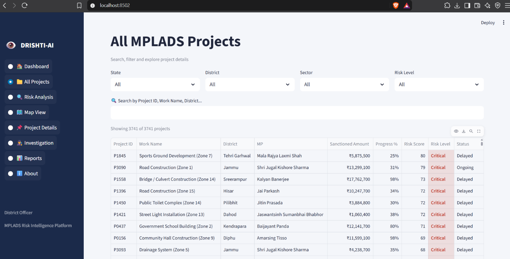
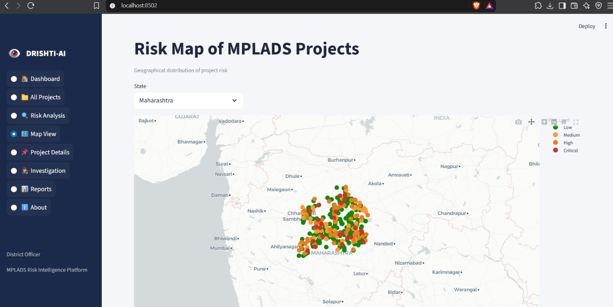
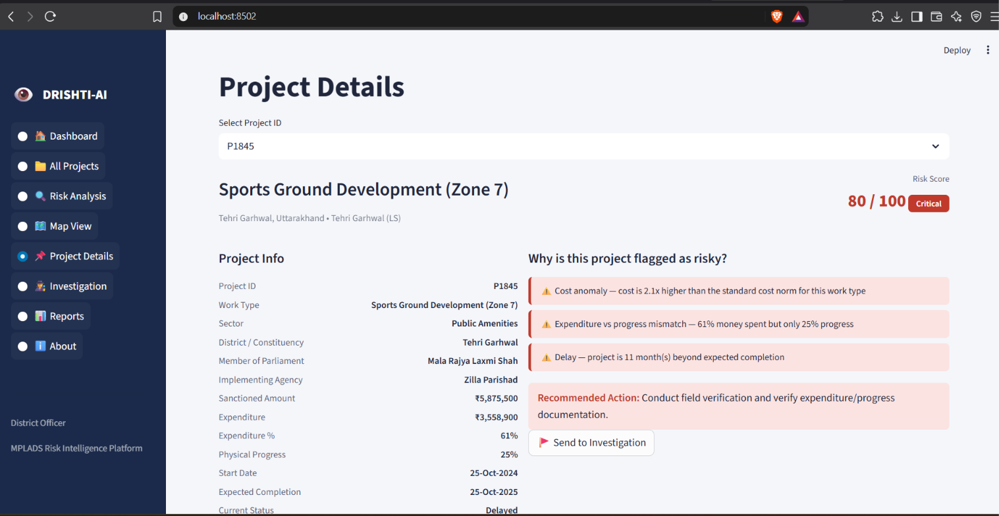
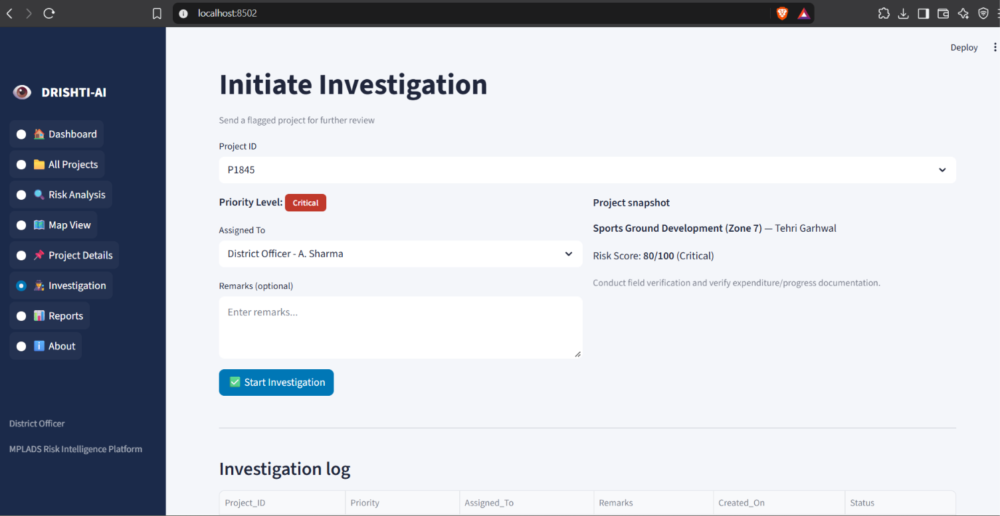
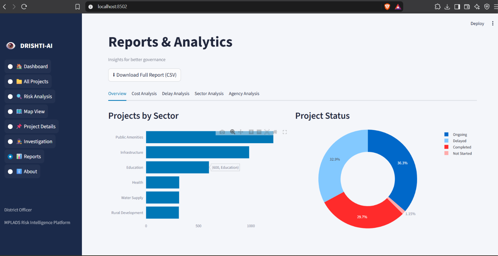
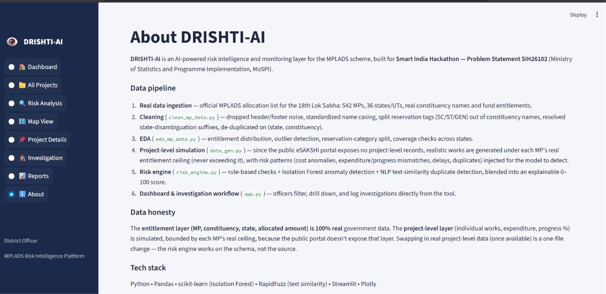

# 🔎 DRISHTI-AI — MPLADS Risk Intelligence & Monitoring Platform

### AI-Powered Risk Detection and Monitoring Platform for MPLADS

> **SIH26102 | Smart India Hackathon | Ministry of Statistics & Programme Implementation (MoSPI)**

DRISHTI-AI is an **AI-powered risk intelligence and monitoring platform** designed to help identify potentially unusual, delayed, anomalous, or duplicate development projects under the **Members of Parliament Local Area Development Scheme (MPLADS)**.

The platform combines **real government entitlement data**, simulated project-level records, rule-based risk checks, machine-learning anomaly detection, NLP-based similarity detection, interactive dashboards, geographical visualization, and investigation workflows into a single Streamlit application.

---

## 🚀 Live Demo

> Add your deployed Streamlit URL here after deployment.

**🌐 Live Application:**  
`https://your-app-name.streamlit.app`

---

# 📌 Table of Contents

- [Problem Statement](#-problem-statement)
- [Solution](#-solution)
- [Key Features](#-key-features)
- [Dashboard Pages](#-dashboard-pages)
- [Technology Stack](#-technology-stack)
- [System Architecture](#-system-architecture)
- [Data Pipeline](#-data-pipeline)
- [Real vs Simulated Data](#-real-vs-simulated-data)
- [Risk Engine](#-risk-engine)
- [Risk Scoring](#-risk-scoring)
- [Project Structure](#-project-structure)
- [Installation](#-installation)
- [Running the Application](#-running-the-application)
- [Regenerating the Dataset](#-regenerating-the-dataset)
- [Dashboard Screenshots](#-dashboard-screenshots)
- [Investigation Workflow](#-investigation-workflow)
- [Data Honesty](#-data-honesty)
- [Future Scope](#-future-scope)
- [Deployment](#-deployment)
- [Important Notes for Judges](#-important-notes-for-judges)
- [Team](#-team)

---

# 🎯 Problem Statement

### SIH26102 — MPLADS Risk Intelligence

MPLADS involves a large number of development works distributed across constituencies, districts, states and Union Territories.

Monitoring such projects manually can make it difficult to quickly identify:

- Unusual project costs
- Delayed projects
- Expenditure and physical progress mismatches
- Potential duplicate or split works
- Unusual project patterns
- High-risk projects requiring investigation
- Fund utilisation patterns

DRISHTI-AI addresses this challenge by providing a centralized **risk intelligence and monitoring layer**.

---

# 💡 Our Solution

DRISHTI-AI combines multiple analytical techniques to generate an **explainable project risk score from 0–100**.

The platform evaluates projects using three major signals:

### 1. Rule-Based Risk Detection

Checks projects for:

- Cost anomalies
- Expenditure vs physical progress mismatch
- Delayed projects
- Projects exceeding expected timelines

### 2. Machine Learning

Uses:

**Isolation Forest**

to identify unusual combinations of:

- Sanctioned amount
- Expenditure percentage
- Physical progress percentage
- Days overdue

### 3. NLP Similarity Detection

Uses:

**RapidFuzz**

to identify potentially duplicate or split works based on:

- Similar project names
- Same district
- Similar project costs
- Overlapping start dates

These signals are combined into an explainable **0–100 risk score**.

---

# ⭐ Key Features

## 📊 Interactive Dashboard

Provides an overview of:

- Total projects
- Total allocation
- Fund utilisation
- Risk distribution
- High-risk projects
- State-wise project information

---

## 🚨 Risk Analysis

Identifies projects requiring attention using:

- Risk scores
- Risk categories
- Anomaly detection
- Delay analysis
- Cost anomalies
- Duplicate project detection

---

## 🗺️ Map View

Provides geographical visualization of projects across India.

The map displays project-level risk information using geographical coordinates generated around state/UT centroids.

---

## 🔍 Project Details

Allows users to inspect individual projects and view:

- Project information
- Sanctioned amount
- Expenditure
- Physical progress
- Expected completion
- Risk score
- Risk reasons

---

## 🕵️ Investigation Workflow

Officers can:

- Select a project
- Review risk indicators
- Understand why it was flagged
- Record investigation notes
- Submit investigation information

---

## 📑 Reports

Provides summarized risk and project information that can support monitoring and decision-making.

---

## ℹ️ About DRISHTI-AI

The About page explains:

- Data pipeline
- Data sources
- Data honesty
- Risk engine
- Technology stack
- System architecture

---

# 📱 Dashboard Pages

The application contains **8 major pages**:

| # | Page | Purpose |
|---|---|---|
| 1 | 🏠 Dashboard | Overall MPLADS monitoring overview |
| 2 | 📋 All Projects | Explore project-level records |
| 3 | 🚨 Risk Analysis | Analyze potentially risky projects |
| 4 | 🗺️ Map View | Geographic visualization |
| 5 | 📌 Project Details | Detailed project inspection |
| 6 | 🔎 Investigation | Investigation workflow |
| 7 | 📑 Reports | Monitoring reports |
| 8 | ℹ️ About | Project, pipeline and methodology |

---

# 🛠️ Technology Stack

### Programming

- Python

### Data Analysis

- Pandas
- NumPy

### Machine Learning

- Scikit-learn
- Isolation Forest

### NLP / Similarity

- RapidFuzz

### Visualization

- Plotly

### Dashboard

- Streamlit

### Data Storage

- CSV
- Excel

### Development

- VS Code
- Git
- GitHub

---

# 🏗️ System Architecture

```text
                    ┌──────────────────────────┐
                    │   Official MPLADS Data   │
                    │     MP Entitlements     │
                    └────────────┬─────────────┘
                                 │
                                 ▼
                    ┌──────────────────────────┐
                    │      Data Cleaning        │
                    │    clean_mp_data.py      │
                    └────────────┬─────────────┘
                                 │
                                 ▼
                    ┌──────────────────────────┐
                    │       EDA & Analysis      │
                    │     eda_mp_data.py       │
                    └────────────┬─────────────┘
                                 │
                                 ▼
                    ┌──────────────────────────┐
                    │ Project-Level Simulation  │
                    │       data_gen.py         │
                    └────────────┬─────────────┘
                                 │
                                 ▼
                    ┌──────────────────────────┐
                    │       Risk Engine         │
                    │     risk_engine.py        │
                    │                          │
                    │  • Rule-Based Checks     │
                    │  • Isolation Forest      │
                    │  • RapidFuzz Similarity  │
                    └────────────┬─────────────┘
                                 │
                                 ▼
                    ┌──────────────────────────┐
                    │      Risk Score 0–100     │
                    └────────────┬─────────────┘
                                 │
                                 ▼
                    ┌──────────────────────────┐
                    │     Streamlit Dashboard   │
                    │                          │
                    │ • Dashboard              │
                    │ • Projects               │
                    │ • Risk Analysis          │
                    │ • Map View               │
                    │ • Investigation          │
                    │ • Reports                │
                    │ • About                  │
                    └──────────────────────────┘
                    ---

# 📸 Dashboard Screenshots

## 🏠 1. Dashboard — Home


---

## 📋 2. All Projects


---

## 🗺️ 3. Map View


---

## 📌 4. Project Details


---

## 🔎 5. Investigation


---

## 📑 6. Reports


---

## ℹ️ 7. About


---

# 🚀 Project Status

DRISHTI-AI is currently available as a working Streamlit prototype with:

- ✅ 3,741 simulated project-level records
- ✅ 542 real MPLADS constituencies
- ✅ 36 States/UTs
- ✅ Rule-based risk detection
- ✅ Isolation Forest anomaly detection
- ✅ RapidFuzz similarity detection
- ✅ Explainable risk scores
- ✅ Interactive Streamlit dashboard
- ✅ Geographic visualization
- ✅ Investigation workflow
- ✅ Monitoring reports
---

# 📸 Dashboard Screenshots

## 🏠 1. Dashboard — Home


---

## 📋 2. All Projects



---

## 🚨 3. Risk Analysis

> Risk Analysis screenshot will be added here.

---

## 🗺️ 4. Map View



---

## 📌 5. Project Details



---

## 🔎 6. Investigation



---

## 📑 7. Reports



---

## ℹ️ 8. About



---

# 🔎 Investigation Workflow

1. Select a high-risk project.
2. Review the generated risk score.
3. Inspect the individual risk indicators.
4. Review the risk reasons.
5. Record investigation notes.
6. Submit the investigation information.

---

# 🧾 Data Honesty

The entitlement data used by DRISHTI-AI is based on official MPLADS allocation information.

The project-level records used in this prototype are simulated because publicly accessible project-level records were not available in a directly usable public CSV/API format.

The simulated records use real:

- MP / constituency information
- State / UT information
- Allocation ceilings

The simulated project records allow the complete risk-detection pipeline to be demonstrated.

> **Important:** The project-level records shown in this prototype should not be interpreted as actual government project records.

---

# 🚀 Future Scope

- Integration with live MPLADS project-level data
- Automated data ingestion from government portals
- Real-time project monitoring
- Satellite and geospatial verification
- Contractor-level risk analysis
- Historical risk trends
- Automated alerts
- Role-based officer access
- Advanced fraud and anomaly detection
- Cloud deployment
- API integration

---

# ☁️ Deployment

The application can be deployed using:

- Streamlit Community Cloud
- Docker
- Cloud platforms
- Government / institutional infrastructure

The application is designed so that the simulated project dataset can later be replaced with real project-level data.

---

# 🧑‍⚖️ Important Notes for Judges

DRISHTI-AI is a **prototype risk-intelligence system**, not a system that declares a project fraudulent.

The system identifies projects that may require further human investigation.

Its main purpose is to help monitoring officers prioritize potentially unusual projects using:

- Rule-based detection
- Machine-learning anomaly detection
- NLP similarity detection
- Explainable risk scores
- Geographical visualization
- Investigation workflows

The final decision remains with the authorized human officer.

---

# 👥 Team

**DRISHTI-AI**

Smart India Hackathon 2026

SIH Problem Statement: **SIH26102**

Ministry of Statistics & Programme Implementation (MoSPI)

---

# 📄 License

This project is developed as a prototype for Smart India Hackathon 2026.

---

## 🔎 DRISHTI-AI

### *From Data to Risk. From Risk to Action.*